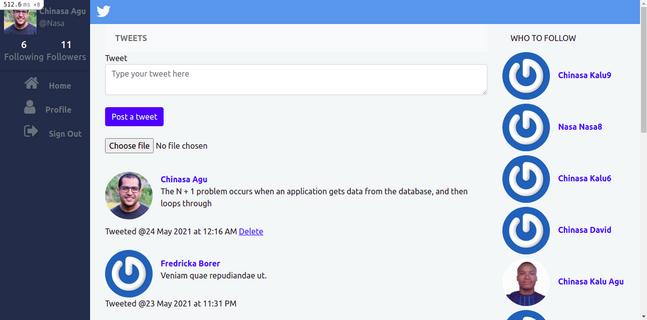
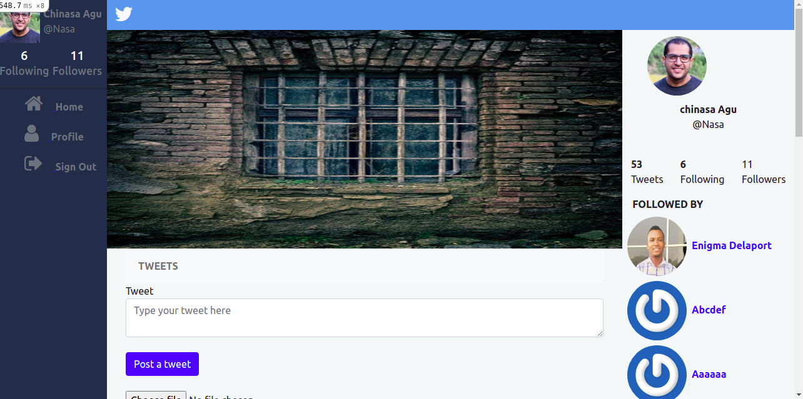

# Twittter Redesign

-  

> This project is a prototype of the Twitter app where a logged in user can create a tweet, view other users profile, follow other users, see who other users are following, create a tweet, delete ONLY his tweet.
The project is basically for accademic purposes.







## Built With

- Ruby v2.7.0
- Ruby on Rails v6.1.3.1
- Bootstrap
- SQLite 3
- Devise gem
- Capybara(Integration test)
- Rspec (Unit test)
- Bootstrap
- Webpack
- aws 
- active_storage
- image_processing gem


## Live Demo

[Click here for Live Demo]('')


## Getting Started

To get a local copy up and running follow these simple example steps.
On your terminal, run 
```
 git clone git@github.com:Nasa28/Twitter_redesign.git

```

### Prerequisites

Ruby: 2.6.3
Rails: 5.2.3
Postgres: >=9.5

### Setup

Install webpacker with:

```
bundle exec rake webpacker:install
```
Install ImageMagick with:

```
sudo apt-get install imagemagick
```

Install gems with:

```
bundle install
```

Setup database with:

```
   rails db:create
   rails db:migrate
```

### Usage

Start server with:

```
    rails server
```

Open `http://localhost:3000/` in your browser.

### Run tests

```
    rpsec --format documentation
```

### Deployment

TBA

## Authors

👨‍💻 **Kalu Chinasa Agu**

- Github: [@Nasa28](https://github.com/Nasa28)
-  Twitter: [@Ultimate_Nasa](https://twitter.com/Ultimate_Nasa)
- LinkedIn: [LinkedIn](https://www.linkedin.com/in/kalu-chinasa-agu-a15080103/)

## 🤝 Contributing

Contributions, issues and feature requests are welcome!

Feel free to check the [issues page](https://github.com/Nasa28/Twitter_redesign/issues).

## Show your support

Give a ⭐️ if you like this project!

## Acknowledgments
[Gregoire Vella](https://www.behance.net/gallery/14286087/Twitter-Redesign-of-UI-details) on Behence for the UI design


## 📝 License

TBA

